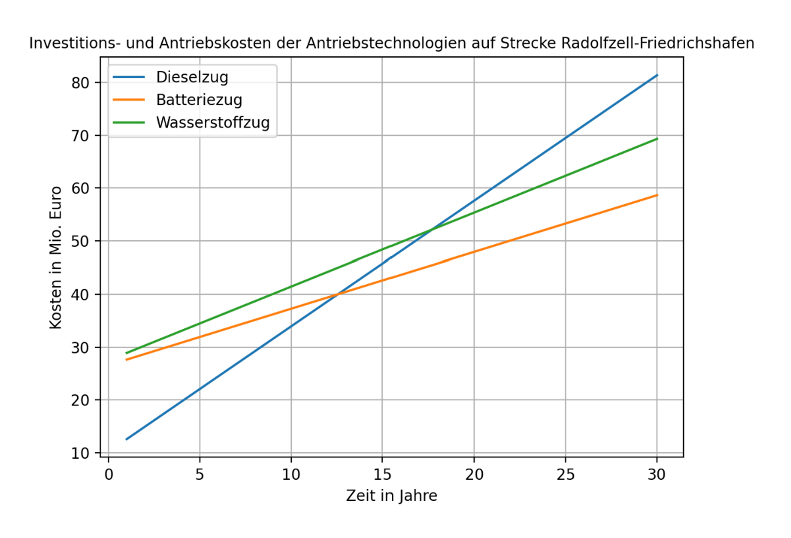

# 📘 Model for Selecting Optimal Drive Technologies for Rail Transport: The Radolfzell–Friedrichshafen Line 
## 🔗 Online Access

- Thesis, Project Video, Summary, Presentation, Poster: <https://drive.google.com/drive/folders/1uvtkVMngmoj268icvehPI8oGFRSw08Og>

## 🔍 Abstract
This research paper investigates the development of a calculation model to identify the most suitable propulsion technology for rail transport on the Radolfzell - Friedrichshafen route, specifically comparing hydrogen, diesel, and battery-electric drives. As the German rail network is currently only 60 percent electrified, finding sustainable alternatives to diesel for regional lines is critical for achieving climate neutrality by 2040. The study employs a model-based approach that evaluates "total costs" over a 30-year observation period as the primary target variable, incorporating both initial investment costs for rolling stock and infrastructure—such as charging or refueling stations—and ongoing energy costs. Using a Python-based simulation, the model calculates energy requirements by integrating physical factors including air and rolling resistance, acceleration, track elevation, and energy recovery through rekuperation. For the specific 60 km regional route examined, the results indicate that while the diesel train requires the lowest initial investment, the battery-electric train becomes the most cost-effective option after approximately 12 to 13 years due to its superior energy efficiency and lower electricity costs. However, when the model is scaled to long-distance scenarios (600 km), hydrogen technology emerges as the more economical choice because the high infrastructure costs required for extensive battery-charging electrification make battery-electric propulsion prohibitively expensive. Sensitivity analysis further reveals that the model is highly susceptible to energy price fluctuations; for instance, more than doubling the electricity price from €0.17 to €0.37 per $kWh$ would render the battery-electric drive the least favorable option even on regional routes. The study concludes that while the current model favors battery-electric trains for the Radolfzell - Friedrichshafen line under specific assumptions, further research including maintenance costs, inflation, and environmental emissions is necessary for practical implementation.

## 📖 Citation

If you find this project useful for your research, please consider citing it:

```bibtex
@thesis{Stoelzle2024Model,
  author      = {St{\"o}lzle, Johannes},
  title       = {Model for Selecting Optimal Drive Technologies for Rail Transport: The Radolfzell–Friedrichshafen Line},
  institution = {Kantonsschule Romanshorn},
  year        = {2024},
  type        = {Thesis},
  url         = {https://github.com/jostoelz/Model-for-Selecting-Optimal-Drive-Technologies-for-Rail-Transport}
}
```

## 🧭 Visual Overview

<p align="center">
  
  <br/>
  <em>Investment and propulsion costs of drive technologies on the Radolfzell–Friedrichshafen route over 30 years.</em>
</p>

## 📜 License

[](https://opensource.org/licenses/Apache-2.0)

This project is licensed under the Apache License 2.0 - see the [LICENSE](LICENSE) file for details.

---
✨ Enjoy exploring the thesis materials. 
